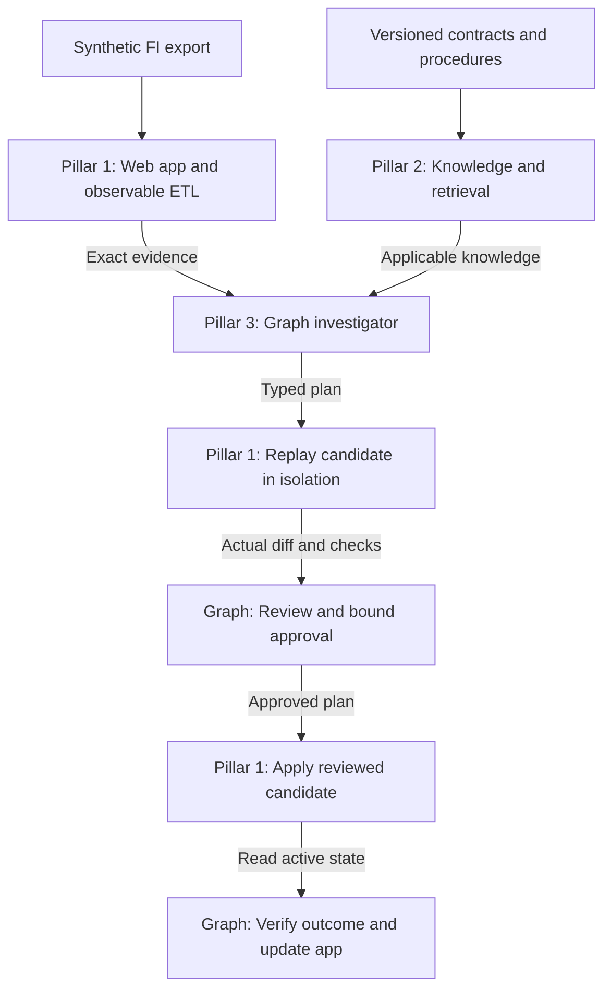

# System Architecture

[Documentation home](README.md) · [Scope](project-scope.md) · [Interface contracts](shared/interface-contracts.md)

**Status:** Planning baseline — implementation not yet verified.

## Three Pillars, One Product

| Pillar | Owns | Boundary |
|---|---|---|
| [Web App and Observable ETL](pillars/01-web-app-and-etl/README.md) | FI source records, transformations, loaded data, presentation evidence, and sandbox replay/application services | Operational observations and execution receipts come from real code |
| [Domain Knowledge and Retrieval](pillars/02-knowledge-and-retrieval/README.md) | Curated domain documents, applicability metadata, version selection, and retrieval provenance | Descriptions of expected behavior are distinct from evidence of what actually executed |
| [Graph-Based Investigator](pillars/03-graph-investigator/README.md) | Investigation state, reasoning, permitted tool calls, hypothesis revision, resolution proposals, and approval/verification flow | Model output cannot change permissions or bypass required transitions |

These are logical ownership boundaries. The POC may implement them in one application and one database; three pillars do not require three independently deployed services.

The diagram follows the supported correction path. During investigation the graph can request more evidence or knowledge within its limits. Findings that need no supported correction return directly to the app.

## Baseline Investigation Design

Deterministic intake establishes authorized record identity and captures the selected display context. Known lookups collect the initial operational evidence and exact applicable contracts. A capable existing reasoning model directs unresolved investigation inside LangGraph, with bounded additional retrieval and deterministic checks.

Known checks may establish a cause without further model inference. The system should use that result. At least one reserved demonstration case must also show a meaningful model contribution to an unresolved investigation, as defined in [AC-04](shared/acceptance-and-readiness.md#ac-04). Hidden test labels are never evidence.

Start with one reasoning model and replaceable model interfaces. A domain SLM specialist, an SLM planner, or a fine-tuned adapter can be added if evaluation demonstrates a benefit. Do not make a low-confidence threshold the only way to reopen a mistaken plan.

## Resolution Design

For the supported amount-mapping defect, the graph produces a typed plan. The operational service reprocesses retained source data in an isolated copy with the candidate configuration. The graph presents impact, diffs, and checks for review, then permits application of the exact reviewed artifact to the sandbox. It closes the repair only after authoritative verification.

The exact plan fields, statuses, and ownership are defined once in [interface contracts](shared/interface-contracts.md). Detailed transitions live in the [resolution workflow](pillars/03-graph-investigator/resolution-workflow.md).

## Cross-Pillar Rules

- Scope all retrieval and execution using server-established FI and actor permissions.
- Pin source, contract, mapping, renderer, and model/prompt versions used by an investigation.
- Treat retrieved text and source values as data. They cannot grant tool privileges or alter execution policy.
- Persist investigations, evidence references, approvals, and execution receipts across refreshes and interruptions.
- Keep operational observations, documentary assertions, model proposals, and verified outcomes distinguishable.
- Route missing evidence to an unresolved finding; a larger model does not create absent facts.

## Storage and Integration Choices

Use the team's familiar web stack, a small relational store, immutable evidence artifacts, and a persistent graph checkpointer. Exact framework, deployment, model endpoint, and retrieval implementation remain open in the [decision register](decisions.md).

Known document IDs should use exact retrieval; supplementary discovery may use lexical or semantic search. A vector database and MCP are optional implementation choices. Preserve stable contract boundaries before choosing additional infrastructure.

LangGraph supports [custom workflows](https://docs.langchain.com/oss/python/langchain/multi-agent/custom-workflow), [persistence](https://docs.langchain.com/oss/python/langgraph/persistence), and [interruptions for external input](https://docs.langchain.com/oss/python/langgraph/interrupts). Those facilities support the design; application code still owns authorization, idempotency, and verification.
